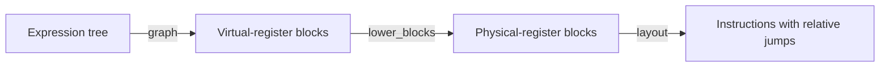
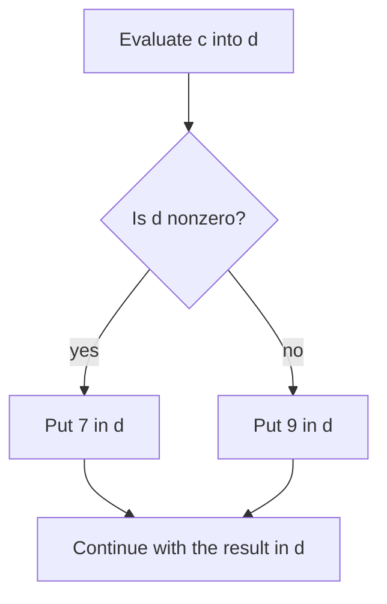

# The compiler example

[compiler.ml](compiler.ml) is a small compiler with a proof that its output
computes the same answer as its input. It starts with an expression, turns it
into labelled blocks of instructions, replaces excess registers with memory
accesses, and resolves the labels into relative jumps. The final program runs
on a model with 32 registers and byte-addressed spill memory.

The interesting part is the connection between these stages. Choosing
instructions, taking the right branch, and moving values between registers
and memory must all preserve the meaning of the original expression. The
implementation and its proofs live together in one OCaml file, checked by Mica.
The instructions follow an RV32I subset; producing encoded machine code is
outside this example.

## What it compiles

The source language has 32-bit constants, variables, addition, let-bindings,
and conditionals. Arithmetic wraps at 32 bits. A condition is false when its
value is zero and true otherwise.

Variables use positions rather than names: position zero means the nearest
surrounding binding, position one the next binding out, and so on. For example,
`let x = 40 in x + 2` is represented by:

```ocaml
Bind (Cst 40l, Plus (Var 0, Cst 2l))
```

The function `eval` defines the meaning of an expression by evaluating it in
an environment of bound values. This is the reference against which compiled
execution is proved correct. The input is already an expression tree; the
example does not parse source text.

## Compiling to virtual registers



The first stage can use as many register indices as it needs. It chooses a
destination register for each expression and uses higher registers for
intermediate results. Registers holding surrounding bindings stay below this
scratch area, so evaluating a subexpression does not destroy its environment.
Top-level compilation starts at register 1. Register 0 always reads as zero
and ignores writes.

A variable becomes a register copy. An addition normally evaluates its left
operand into the destination and its right operand into the next register,
then adds them. A let-binding keeps the bound value in the destination while
compiling its body one register higher, then copies the body's result back.
Registers can be reused as recursive compilation returns.

There are two useful instruction-selection details:

- An arbitrary 32-bit constant is split into an upper part and a signed low
  part, loaded with `Lui` followed by `Addi`. The proof checks both that these
  parts reconstruct the constant and that their immediate fields are legal.
- When the right operand of addition is a literal that fits a signed 12-bit
  immediate, compilation selects `Addi` directly. This saves both instructions
  and scratch-register space.

## Giving conditionals somewhere to go

A conditional needs to choose which instructions to execute. The compiler
organizes instructions into *basic blocks*: each block has a label, a sequence
of ordinary instructions, and an ending that says where execution goes next.
That ending, called a terminator, is one of three things: jump to another
block, branch to one of two blocks according to a register, or return a value.
The blocks and their connections form a control-flow graph, or CFG.

For `if c then 7 else 9`, the shape is:



Only the selected alternative runs. Both alternatives leave their result in
the same register and jump to the same continuation: the code that should
run after the conditional. This also lets the condition and both alternatives
reuse the same scratch registers. Once the branch has been taken, the
condition's value is no longer needed.

The function `build` constructs this code by working backwards from a
continuation. For an addition, for example, it first arranges the final add,
then puts the right operand's computation before it, then the left operand's
computation before that. The resulting execution order is left, right, add.
For a conditional, `close` gives the continuation a label so that both
alternatives can reach it without duplicating it. `graph` starts this process
with a continuation that returns register 1.

Labels are local to a graph. Every generated edge points to a block created
earlier, and those blocks occur later in the final list. Execution therefore
moves forwards through the list, with no cycles.

`need` computes how much consecutive register space an expression requires,
including its destination. It follows the compilation strategy, rather than
just measuring tree depth. For a conditional it takes the maximum of the
condition's and the two alternatives' requirements, since their registers
can be reused.

## Spilling to memory

The second stage assigns a physical home to each virtual register:

| Virtual register | Physical home |
| --- | --- |
| 0 through 28 | The same physical register |
| 29 and above | Successive four-byte memory slots |

Physical registers 29 and 30 are reserved for loading spilled operands.
Register 31 holds a spilled result before it is stored. For each virtual
instruction, lowering emits any needed loads, the arithmetic instruction with
physical register numbers, and any needed store. This also works when sources
and destinations refer to the same virtual register.

For example, adding virtual registers 29 and 30 into virtual register 31
produces the following sequence, written in assembly-like notation:

```text
lw  x29, 0(x0)        # load virtual register 29
lw  x30, 4(x0)        # load virtual register 30
add x31, x29, x30
sw  x31, 8(x0)        # store virtual register 31
```

`lower_blocks` applies this translation to each block. If a branch or return
uses a spilled value, it adds a load at the end of the block body, just before
that value is needed by the terminator. The connections between blocks stay
the same.

Spill memory stores words in little-endian order. It is represented by an
immutable vector of bytes; a store produces an updated vector. An invalid
memory access puts the machine in a failed state that subsequent instructions
cannot clear.

The spill frame begins at byte address zero, allowing loads and stores to use
`x0` as their base. Signed 12-bit offsets permit 512 spill words, or 2048 bytes.
With virtual registers 1 through 28 kept in physical registers, this supports
expressions with `need e <= 540`.

## Turning labels into jumps

`layout` places the physical blocks consecutively and replaces their
terminators with instructions. It runs after spilling so that its distances
include every inserted load and store. Each instruction occupies four bytes,
and jump distances are measured from the current instruction.

A branch becomes two instructions:

```text
bne condition, x0, nonzero_target
jal x0, zero_target
```

A nonzero condition takes the first transfer; a zero condition falls through
to the unconditional jump. An ordinary block-to-block jump also uses
`jal x0`, which discards the return address. A `Return r` copies `r` to `x1`
and jumps to the fragment exit, immediately after the code. This exit marks
completion in the model; there is no caller or calling convention.

The entry point `assemble` returns `Compiled (code, spill_bytes)` or
`Unsupported reason`. It checks two bounds before running the passes:

- `need e <= 540` keeps spill accesses within the fixed frame.
- `cost e <= 1021` keeps relative transfers within the instruction fields.

`cost` is a conservative estimate. It allows up to four physical instructions
for each virtual instruction, and includes the transfers needed by
conditionals. The final return adds two more instructions, so the emitted code
has at most `cost e + 2` instructions. This bound ensures that conditional
branches can reach their targets directly. An expression can fail the check
even if its actual code would fit; the compiler does not expand long branches.

## What the proofs establish

The proof is divided along the compilation stages, with smaller lemmas for
register updates, instruction sequences, and memory operations.

**Source to virtual execution.** `compute_correct` proves that the register
operations chosen for an expression produce its source value and preserve
registers below the destination. `build_correct` proves that the generated
blocks perform these operations and then run their continuation.
`graph_correct` connects this to the virtual CFG interpreter and proves that
the graph returns the source result. The interpreter has a fuel counter to
bound execution; generated graphs finish with enough fuel.

**Virtual to physical execution.** `simulation` relates each virtual register
to its physical register or memory slot. The memory lemmas show that a stored
word can be read back and that other slots retain their values.
`lower_blocks_correct` proves that lowering preserves this relation and the
chosen successor or returned value. `graph_allocation` and
`lower_blocks_valid` establish the operand locations and physical instruction
fields needed by this stage.

**Blocks to relative jumps.** `layout_exists` proves that graphs with the
required forward connections can be laid out. `layout_valid` proves field
validity under the size bound, and `layout_correct` connects execution of
physical blocks to execution of the laid-out instructions. Because transfers
only go forwards, the total instruction count supplies enough fuel.

**The complete result.** For every expression satisfying the two bounds,
`assemble_valid` proves that assembly succeeds, the emitted fields are legal,
and the returned spill size is sufficient and at most 2048 bytes.
`assemble_correct` proves that execution from 32 zeroed registers and the
returned number of zeroed memory bytes finishes without failure or fuel
exhaustion, with `eval (e, [])` in `x1`. These results require successful
compilation; returning `Unsupported` does not satisfy them.
`graph_layout_correct` also covers initial states satisfying the more general
simulation relation. `assembled_case` applies the complete result to a small
conditional with an arbitrary 32-bit condition.

The proof declarations are ghost code, removed before OCaml compilation.
Recursive proof helpers have decreasing measures. Computational definitions
used in proofs also have verified runtime implementations; opaque definitions
are unfolded explicitly where a proof needs their equations.

## Where the model stops

The output is a list of instruction constructors and a memory requirement.
`execute` interprets that list with relative transfers. There is no binary
encoding, instruction fetch, or proof connecting it to hardware. Code and
spill memory are separate, even though both use addresses starting at zero.

The source has no functions, loops, recursion, mutation, or exceptions.
The final interpreter rejects backward or unaligned transfers and transfers
beyond the fragment. Supporting loops would require a different execution
model and a termination argument.

Variables outside the environment evaluate to zero; a negative index selects
the nearest binding, or zero if the environment is empty. Compilation follows
these rules too, so the correctness result covers such expressions without a
separate scope check. Invalid register reads also return zero, and invalid
writes are ignored, but the allocation and field proofs rule out those
accesses in compiled code.

`assemble` is the entry point that checks the resource bounds. Lower-level
passes such as `lower` rely on allocation and slot bounds supplied by their
callers and do not independently reject every unsupported input.

## Checking the example

From the repository root:

```bash
opam exec -- lake run testsuite Examples/compiler/compiler.ml
```

This checks OCaml compilation after ghost erasure and runs Mica verification
of the implementation and its proofs.
